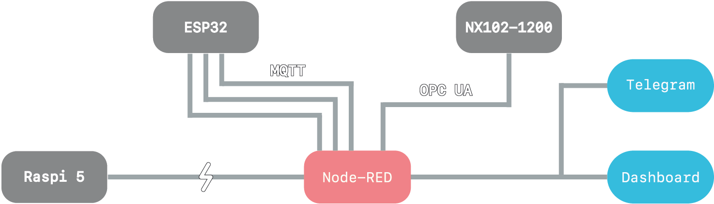

<p align="center">
  
</p>

<h1 align="center">Arkeos</h1>
<p align="center">
  Automazione distribuita e controllo remoto. Esame finale del corso UF17 Reti e bus di campo.<br>
  Raspberry Pi 5 • ESP32 • PLC • Node-RED
</p>

<p align="center">
  
  
  
</p>

---

## ✨ Cos'è Arkeos

**Arkeos** è un progetto di automazione distribuita che integra Raspberry Pi 5, microcontrollori ESP32 e PLC industriali tramite un server **Node-RED** su Raspberry Pi5.

È progettato per essere **scalabile**, **reattivo** ed estremamente **user-friendly**, grazie all'interfaccia grafica accessibile da browser. L'obiettivo è creare un ponte tra hardware eterogeneo, semplificandone la comunicazione, la visualizzazione e il controllo.

---

## ⚙️ Architettura del Sistema

- **Raspberry Pi 5** come hub centrale
- **ESP32** per sensori e attuatori remoti tramite MQTT
- **PLC** industriale per la logica di controllo macchina
- **Node-RED** come cuore e cervello del progetto
- **Telegram Bot** per notifiche e comandi remoti



---

## 🧠 Funzionalità principali

- 🔌 Controllo remoto di dispositivi e attuatori
- 📊 Dashboard live in tempo reale
- 💬 Bot Telegram integrato per allarmi e comandi
- 🔁 Sincronizzazione tra ESP32 e PLC
- 💾 Logging e data storage

---

## 📥 Installazione

> ⚠️ Requisiti: Node.js, Python 3.x, ESP32 con firmware compatibile, Raspberry Pi/VM, PLC con server OPCUA attivo

1. Installare **Node-RED** e abilitare l'autostart all'avvio (vedi `https://nodered.org/docs/getting-started/raspberrypi`):
```bash
bash <(curl -sL https://github.com/node-red/linux-installers/releases/latest/download/update-nodejs-and-nodered-deb)
sudo systemctl enable nodered.service
```
2. Installare le **palette** necessarie:
```bash
cd ~/.node-red
npm install node-red-dashboard node-red-contrib-opcua node-red-contrib-telegrambot node-red-contrib-ui-led2 node-red-node-random node-red-node-ui-table
```
3. Clonare la **repo** di Arkeos:
```bash
git clone https://github.com/hert1zm/Arkeos.git
```
4. Aprire **Node-RED** dal browser (disponibile su `http://localhost:1880`)
5. Menù > Import > Select a file to import
6. Importare `arkeos/nodered/arkeos-flows.json`
7. Cliccare su **Importa** e poi su **Deploy**

> ✔️ Assicurarsi infine di avere le corrette misure della dashboard impostate su Node-RED per garantire un'esperienza ottimale di visualizzazione:

Dal menù di destra: **Dashboard** > **Site** : In fondo alla finestra
- **1x1 Widget Size** 46 46
- **Widget Spacing** 6 6
- **Group Padding** 0 0
- **Group Spacing** 30 30
  
---

## 📘 Note per l'esame UF17

> ⚠️ **ESP32 - MQTT**

Nonostante abbia fatto funzionare Arkeos con **ESP32**, comunicando su protocollo MQTT, ho deciso di lasciare comunque degli **inject** per poter controllare i valori che venivano letti dai sensori a bordo macchina in maniera semplice direttamente da NodeRed.

Tutti e 4 i parametri hanno **3 valori impostabili manualmente** (tranne le vibrazioni): il 1° è un valore **normale** accettabile dalla macchina, il 2° è un valore alto che triggera un'**allarme**, mentre il 3° è un valore critico che porta la macchina in **emergenza**.

È inoltre presente un randomizzatore che invia valori fittizi normali (quindi senza allarmi ed emergenze) ogni 5 secondi (modificabili dai flow di Node-RED).

> ⚠️ **OPCUA**

Per quanto riguarda la comunicazione via protocollo OPCUA, tutti i processi che riguardano la comunicazione con un PLC sono **simulate**, non potendo interfacciarmi fisicamente con un PLC.

Sono però **del tutto funzionanti**, nel caso in cui si volesse collegare veramente un PLC; le ho infatti testate con un **OMRON NX102-1200** e funzionano correttamente.

Pe esempio, i blocchi di invio della conferma dopo aver scritto sulle variabili del PLC, in realtà andrebbero collegato al primo output del client OPCUA, ovvero ovvero l'output "success", e non prima dell'invio del dato al PLC.

> ⚠️ **RASPBERRY**

Anche per quanto riguarda Raspberry, il progetto lo tratterà come una **simulazione**, nonostante io abbia utilizzato un **Pi5** per hostare Node-RED e la comunicazione con il Bot.

Quindi anche gli status delle connessioni con i dispositivi risulteranno **tutte assenti** poichè non ci sono più collegamenti effettivi con i dispositivi.
